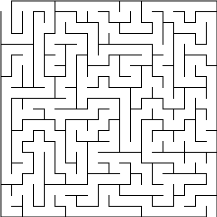
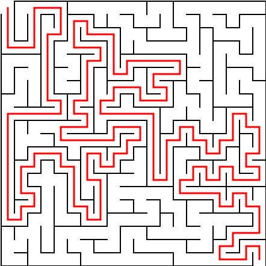
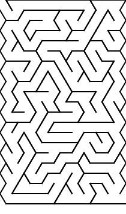
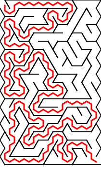
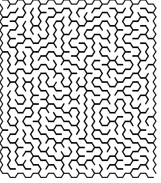
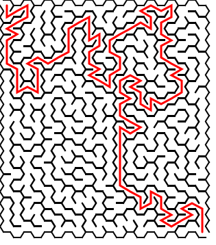

# Rust Maze Generator

A Rust CLI tool that generates solvable mazes on **rectangular, triangular, or hexagonal grids** as SVG files with automatic solution generation.

## Features

- **Three grid types**: Rectangular (4 neighbors), Triangular (3 neighbors), Hexagonal (6 neighbors)
- **Generic maze implementation**: Uses Rust traits and generics for grid-agnostic algorithms
- **Perfect mazes**: Exactly one path between any two points
- **Automatic solving**: BFS pathfinding with red solution path
- **Debug mode**: Optional cell numbering for debugging
- **SVG output**: Scalable vector graphics viewable in any browser
- **Configurable**: Custom dimensions and tunnel width

## Quick Start

```bash
# Build the project
cargo build --release

# Generate a 50x50 rectangular maze
./target/release/maze -W 50 -H 50 -o maze.svg

# Generate a hexagonal maze
./target/release/maze -W 30 -H 30 -g hexagonal -o hex_maze.svg

# Generate with debug cell numbers
./target/release/maze -W 10 -H 10 -d -o debug_maze.svg
```

Each run generates two files:
- `maze.svg` - The unsolved maze
- `maze_solution.svg` - The maze with solution path in red

## Example Output

Sample mazes are included in the `examples/` directory (all 20×20 cells):

### Rectangular Grid

<table>
<tr>
<td></td>
<td></td>
</tr>
<tr>
<td align="center">Unsolved</td>
<td align="center">Solved</td>
</tr>
</table>

### Triangular Grid

<table>
<tr>
<td></td>
<td></td>
</tr>
<tr>
<td align="center">Unsolved</td>
<td align="center">Solved</td>
</tr>
</table>

### Hexagonal Grid

<table>
<tr>
<td></td>
<td></td>
</tr>
<tr>
<td align="center">Unsolved</td>
<td align="center">Solved</td>
</tr>
</table>

## Command-Line Arguments

| Flag | Short | Description | Required | Default |
|------|-------|-------------|----------|---------|
| `--width` | `-W` | Width of maze in cells | Yes | - |
| `--height` | `-H` | Height of maze in cells | Yes | - |
| `--output` | `-o` | Output SVG file path | Yes | - |
| `--tunnel-width` | `-t` | Width of tunnels in pixels | No | 20 |
| `--grid-type` | `-g` | Grid type: rectangular, triangular, hexagonal | No | rectangular |
| `--debug` | `-d` | Enable debug mode (show cell numbers) | No | false |

Note: `-W` and `-H` use capital letters to avoid conflicts with common short flags.

## Architecture

The project uses a **generic trait-based design** that separates grid topology from maze algorithms:

### Core Components

#### 1. `GenericMaze<S: Shape>` (src/genericmaze.rs)
Generic maze structure parameterized by shape type:
- **Fields**:
  - `width`, `height`: Grid dimensions
  - `cells`: Vec of `MazeCell` (each has neighbors and walls)
  - `_shape`: PhantomData marker for the shape type
- **Methods**:
  - `new()`: Creates maze and initializes neighbor relationships
  - `generate()`: Recursive backtracking maze generation
  - `solve()`: BFS pathfinding from cell 0 to last cell
  - `cell_index()`, `cell_coords()`: Coordinate conversion helpers

#### 2. `Shape` Trait (src/genericmaze.rs)
Defines grid-specific behavior:
- `num_neighbors()`: How many neighbors each cell type has
- `init_neighbors()`: Build neighbor relationships for the grid
- `to_svg()`: Render maze as SVG for this grid type
- `print_debug_info()`: Debug output (optional)

#### 3. `MazeCell` (src/genericmaze.rs)
Individual cell in the maze:
- `neighbors: Vec<Option<usize>>`: Indices of neighboring cells (None for edges)
- `walls: Vec<bool>`: Which walls are present (parallel to neighbors)

#### 4. Shape Implementations
Each in its own file under `src/shapes/`:

**RectShape** (rect_shape.rs):
- 4 neighbors per cell: North, South, East, West
- Neighbors indexed as: 0=N, 1=S, 2=E, 3=W
- Standard rectangular grid rendering

**TriShape** (tri_shape.rs):
- 3 neighbors per cell: Left, Right, Top/Bottom
- Alternating up-pointing (△) and down-pointing (▽) triangles
- Neighbors indexed as: 0=left, 1=right, 2=top/bottom

**HexShape** (hex_shape.rs):
- 6 neighbors per cell: N, S, NE, SE, NW, SW
- Flat-top hexagons with odd columns offset down
- Neighbors indexed as: 0=N, 1=S, 2=NE, 3=SE, 4=NW, 5=SW

## Algorithms

### Maze Generation: Recursive Backtracking

**Algorithm**: Depth-first search with backtracking
```
1. Start at cell 0 with all walls present
2. Mark current cell as visited
3. Find all unvisited neighbors (via cells[current].neighbors)
4. If unvisited neighbors exist:
   a. Choose one randomly
   b. Remove wall between current and chosen neighbor (bidirectional)
   c. Push chosen neighbor onto stack
5. If no unvisited neighbors, pop from stack (backtrack)
6. Repeat until all cells visited
```

**Properties**:
- Creates a **perfect maze** (exactly one path between any two cells)
- No loops or isolated sections
- Always solvable
- Random selection creates varied mazes each run

### Maze Solving: Breadth-First Search

**Algorithm**: BFS from entrance to exit
```
1. Start BFS from cell 0 (entrance)
2. For each cell, explore neighbors through open edges (where walls[i] == false)
3. Track parent pointers to reconstruct path
4. Stop when reaching last cell (exit)
5. Backtrack using parent pointers to build solution path
```

**Properties**:
- Finds the **shortest solution path**
- Guaranteed to find a solution (maze is perfect)
- Returns vector of cell indices forming the path

## SVG Rendering

### Rectangular Grids
- Each cell is a rectangle
- Walls are SVG lines at cell boundaries
- Cell size = tunnel_width + wall_thickness (2px)

### Triangular Grids
- Alternating up/down triangles
- Triangle height = tunnel_width × 0.866 (equilateral triangles)
- Width advances by half the tunnel width per column

### Hexagonal Grids
- Flat-top hexagons
- Odd columns offset down by half a hex height
- Width advances by 3/4 of hex width per column

### Solution Path
- Drawn as red SVG path (3px stroke width, round endcaps)
- Connects centers of cells in solution sequence
- Format: `<path d="M x1 y1 L x2 y2 L x3 y3 ..." />`

### Debug Mode
- Adds blue text labels showing cell indices
- Prints neighbor relationships to stdout
- Useful for debugging neighbor initialization

## License

This project is released into the public domain. Use it however you'd like.
